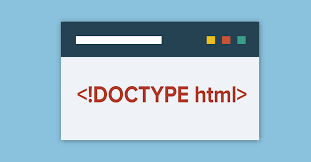

DOCTYPE的全称为Document Type Declaration

所有的html都需要一个DOCTYPE声明，并写在文档的开始。

DOCTYPE并不是一个HTML标签。浏览器通过DOCTYPE来决定如何理解文档，采用哪个HTML版本（标准或其他）来渲染页面。

常用的HTML5 DOCTYPE声明如下（不区分大小写）

```html
<!DOCTYPE html>
```
## HTML5与HTML4 DOCTYPE声明的差异
在HTML 4.01 中，DOCTYPE 声明引用DTD，因为HTML 4.01 基于SGML。DTD 规定了标记语言的规则，这样浏览器才能正确地呈现内容。

在HTML4.01中有三种DOCTYPE声明。

**严格模式：**
```html
<!DOCTYPE HTML PUBLIC "-//W3C//DTD HTML 4.01//EN"  "http://www.w3.org/TR/html4/strict.dtd">
```

**过渡模式：**
```html
<!DOCTYPE HTML PUBLIC "-//W3C//DTD HTML 4.01 Transitional//EN"  "http://www.w3.org/TR/html4/loose.dtd">
```
**框架模式：**
```html
<!DOCTYPE HTML PUBLIC "-//W3C//DTD HTML 4.01 Frameset//EN"  "http://www.w3.org/TR/html4/frameset.dtd">
```
HTML5不基于SGML，所以不需要引用DTD。在HTML5中DOCTYPE只有一种
```html
<!DOCTYPE html>
```
在此种文档模式下，IE6&7中会触发近乎标准模式，IE8以后的版本以及所有现代浏览器中都会触发标准模式。

因此一般情况下，只需要这样声明即可。

但在IE10及以下IE浏览器中，需要在&lt;head&gt;中、在任何脚本之前，增加一个特殊的meta标签，来防止触发**怪异模式**
```html
<meta http-equiv="X-UA-Compatible" content="IE=Edge">
```
## 浏览器渲染模式
前面提到了**怪异模式(quirks mode)**，何为怪异模式，还有其他模式吗？

浏览器渲染html时，通常会采用如下三种模式之一。

* 标准模式(Standards Mode)
* 怪异模式(quirks mode)
* 近乎标准模式(Almost Standards Mode)

这个属于历史遗留问题(IE5.5到IE7那个年代)，现在前端开发已经不用过多关注了。（让那个Chrome还没出现，IE8叫做高级浏览器,兼容IE6&7是前端工程师工作重点的时代随风而去吧）

依稀记得，当年为了在IE6上实现box-sizing: border-box的效果，而将网页设置为怪异模式。


## SGML
前面也提到了，HTML5不基于SGML，所以不需要引用DTD。那SGML到底是个什么东东呢？

先看看某百科的定义：

> 标准通用标记语言（Standard Generalized Markup Language，SGML）是现时常用的超文本格式的最高层次标准，是可以定义标记语言的元语言，甚至可以定义不必采用&lt; &gt;的常规方式。由于它的复杂，因而难以普及。

> 它有非常强大的适应性，也正是因为同样的原因，导致在小型的应用中难以普及。

> HTML和XML同样派生于它：XML可以被认为是它的一个子集，而HTML是它的一个应用。

> XML的产生就是为了简化它，以便用于更加通用的目的，比如语义Web。它已经应用于大量的场合，比较著名的有XHTML、RSS、XML-RPC和SOAP。

由此可见，SGML是HTML的起源，但它比较复杂，限制也多。因此HTML5着眼未来，放弃了对它的遵守。