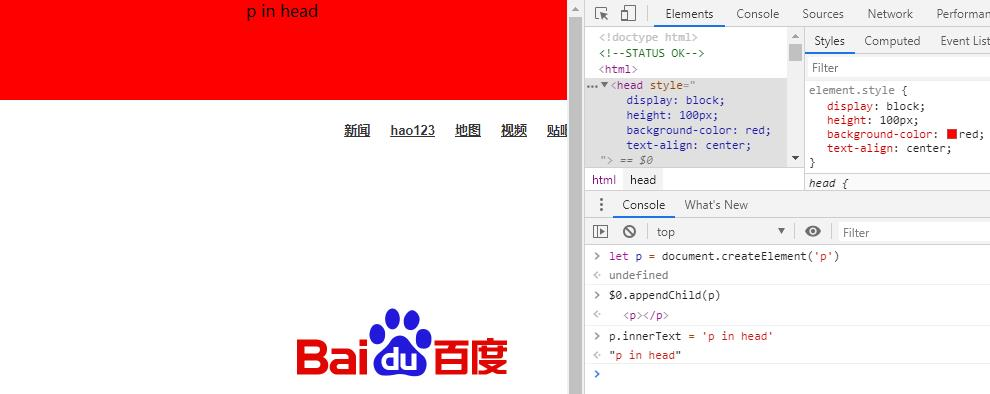

## 关键知识点
如果head中包含js或css外链，在外链加载完成之前，当前页面是空白的状态，因此head中外链js或css必须慎重考虑。这个白屏的时间，对用户体验至关重要。

## head标签介绍
head标签包含那些需要被浏览器或爬虫使用，但不展示给用户的信息。

## base标签
默认情况下，页面中的相对url，都是以当前页面的url为基准的。但通过base标签，可以改变页面中相对url的基准。

但这个标签一般不推荐使用，尤其是在大型的网站中，这会让多人合作时，产生困扰。

## 冷知识 - head一定不显示吗？
大家都知道head里面的内容是不会显示在页面中的，但浏览器（只测试了Chrome）居然是用[user agent style](../css/user_agent_stylesheet.md)将head设置为display:none来隐藏head标签的。

将head的display设置为block后，并设置高度值，它就那么。。。出现了。。。

如果你一开始在head中加入p等不属于head的标签，那么浏览器解析的时候，会自动将其放到body里面。但如果你通过js调用head.appendChild，是能够把p标签插入到head中的。有图有真相

