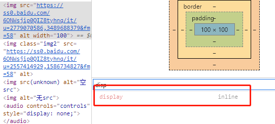

## 关键知识点
警惕img标签src为空
## src为空

## 谜之默认display值
img标签的css display默认值，是个让人困扰的问题。

如果打开浏览器的控制台，你会看到默认值为inline

但你却可以通过css或img的属性设置img的宽和高。这显然和inline元素的特性不符。

经过部分资料查证和测试，我给出的结论是：

img标签的默认display值为inline。但在img标签上，display为inline时的行为和inline-block是一致的。

## 其他默认为inline-block的元素
input, textarea, select, button